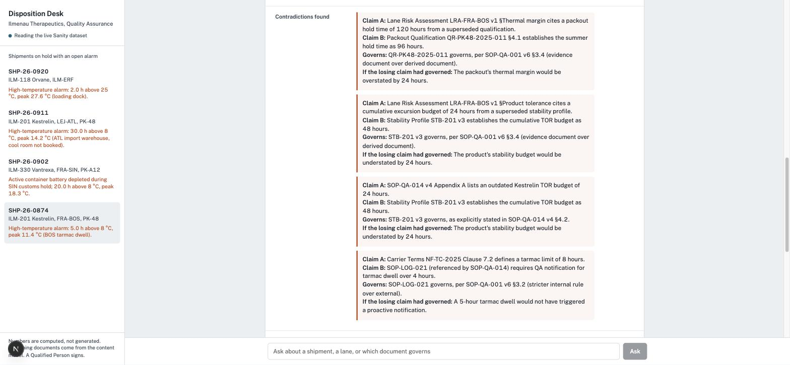

# Disposition Desk



A temperature-excursion disposition agent for a hypothetical pharma sponsor, **Ilmenau Therapeutics GmbH**, built for the [Sanity Challenge](https://dev.to/challenges/sanity) (Path One: an agent that queries real content through Sanity Context MCP).

When a shipment of a 2–8 °C biologic arrives with a temperature alarm, someone in QA has to decide: release, quarantine, or reject. The numbers (mean kinetic temperature, hours out of range, budget consumed) are easy. The hard part is knowing **which document governs**, because the quality binder disagrees with itself:

- The SOP's appendix still quotes the *superseded* stability allowance (24 h). The effective stability summary says 48 h.
- The lane risk assessment assumes the shipper holds 120 h. The current qualification report proved 96 h, and only at ≥ 60 % fill.
- A work instruction lets the warehouse release on MKT alone. The SOP and USP <1079.2> forbid that on a lane with prior excursions.
- The carrier contract allows 8 h on the tarmac. The internal SOP escalates at 4 h.

A keyword search returns all of those and lets the model pick one. This agent walks references instead: `shipment → product → currentStabilityProfile → sourceDocument`, `packout → currentQualification`, `lane → riskAssessment`, `deviation → (lane, product)`. It gets the governing version because the content model *has* a governing version, and it shows the losing claim alongside the winner with both citations.

## What it does

1. **Numbers, deterministically.** `lib/excursion.ts` computes MKT (USP <1079> Haynes equation, time-weighted), time out of range by segment, budget consumption and a rules-based provisional disposition. Pure, unit-tested, no model involved. Ported from a Go implementation with the same invariant tests.
2. **Governance, from structured content.** One GROQ query (`lib/tools.ts`) expands every reference the assessment depends on and counts prior deviations on the same lane and product inside the SOP's 12-month look-back. The same trace is also re-run under every superseded profile so the memo can say what the old answer would have been.
3. **Contradictions, on purpose.** The model reads the governing documents through Sanity Context (GROQ mode for the entity graph, Knowledge Base mode for the compiled prose) and writes a memo that names each contradiction, applies the tie-break rules in SOP-QA-001, and lists what the Qualified Person still has to verify.

Four seeded shipments cover the decision surface:

| Shipment | Situation | Deterministic result |
|---|---|---|
| SHP-26-0911 | Kestrelin, 30 h at ~13 °C in Atlanta, clean lane, 45 % fill | **RELEASE (provisional)** under STB-201 v3; would be REJECT/INVESTIGATE under superseded v2 (the SOP appendix still quotes v2) |
| SHP-26-0874 | Kestrelin, 5 h tarmac at Boston, numbers pass, two prior deviations on the lane | **ESCALATE + CAPA** (USP <1079.2>; the receiving WI would have released it) |
| SHP-26-0902 | Vantrexa mRNA, active container died in Singapore customs, 20 h | **REJECT/INVESTIGATE** (167 % of a 12 h budget) |
| SHP-26-0920 | Orvane tablets, 2 h on a loading dock | **RELEASE (provisional)** |

## Run it

```bash
cp .env.example .env.local     # fill in what you have
npm install
npm test                       # MKT invariants + disposition rules
npm run check                  # deterministic tool over all four shipments, no model, no cloud
npm run mcp:tools              # list the tools the configured Sanity Context endpoints serve
npm run ask -- "Assess shipment SHP-26-0874"   # full agent from the CLI
npm run dev                    # http://localhost:3050  (Studio at /studio)
```

**Offline mode.** With no Sanity project configured the app evaluates the same dataset in-process with `groq-js` (Sanity's own GROQ engine) and registers `groq_query` / `read_document` as stand-ins for the Sanity Context tools. Everything runs; only the Knowledge Base build (contradiction surfacing in the Dashboard) needs the real thing.

**Sanity mode.**
1. `npx sanity@latest init` (writes the project id and dataset to `.env.local`), then `npm run seed` — it exports the dataset to NDJSON, imports it with your CLI login and deploys the schema. (`npm run seed:token` does the same through the API with `SANITY_API_WRITE_TOKEN`.)
2. If unauthenticated reads return nothing even though the dataset is public, mint a Viewer token (`npx sanity tokens add "app read" --role viewer`) and set `SANITY_API_READ_TOKEN`.
3. In the Sanity Dashboard → Context, create a Knowledge Base with the dataset as its source (purpose: "Help QA decide the disposition of a temperature excursion on an Ilmenau shipment"). Build it and resolve the issues it raises; each resolution becomes a standing instruction.
4. Deploy the Studio (`npx sanity deploy`); GROQ mode refuses datasets without a deployed Studio.
5. Create an MCP endpoint for the dataset (GROQ mode) and one for the Knowledge Base, mint an organization token with Context Viewer, and set `SANITY_CONTEXT_MCP_URL`, `SANITY_CONTEXT_KB_MCP_URL`, `SANITY_CONTEXT_TOKEN`.

The model is Claude Opus 5 through the Vercel AI SDK (`ToolLoopAgent`). `DISPOSITION_MODEL=vertex/gemini-2.5-pro` switches to Gemini on Vertex AI with Google ADC; see `lib/model.ts`.

## Layout

```
lib/excursion.ts        deterministic MKT / TOR / disposition (+ tests)
lib/tools.ts            assess_excursion (the reference walk), list_shipments, offline GROQ stand-ins
lib/mcp.ts              Sanity Context MCP client wiring (GROQ + Knowledge Base endpoints)
lib/agent.ts            ToolLoopAgent + the disposition instructions
lib/content.ts          ContentSource: Sanity client or in-process groq-js
sanity/schema/          product, stabilityProfile, packout, packoutQualification, carrier, lane, shipment, deviation, controlledDocument
content/seed.ts         the Ilmenau dataset (entities, generated logger traces)
content/docs/*.md       17 controlled documents with the planted contradictions
app/                    Next.js chat UI (/), API routes, embedded Studio (/studio)
scripts/                seed.ts, ask.ts (CLI), check.ts (no-model smoke test)
```

Live instance: Studio at https://ilmenau-disposition.sanity.studio/, project `f5hwi6cp`, Knowledge Base "Ilmenau Quality System" (13 entries; the build surfaced three of the five planted contradictions as issues on its own: the 24 h/48 h budget, the 25 °C/30 °C ceiling and the 120 h/96 h hold time).

Everything about Ilmenau Therapeutics, its products, carriers and documents is invented.

MIT licensed. The challenge writeup draft is in `docs/submission.md`.
